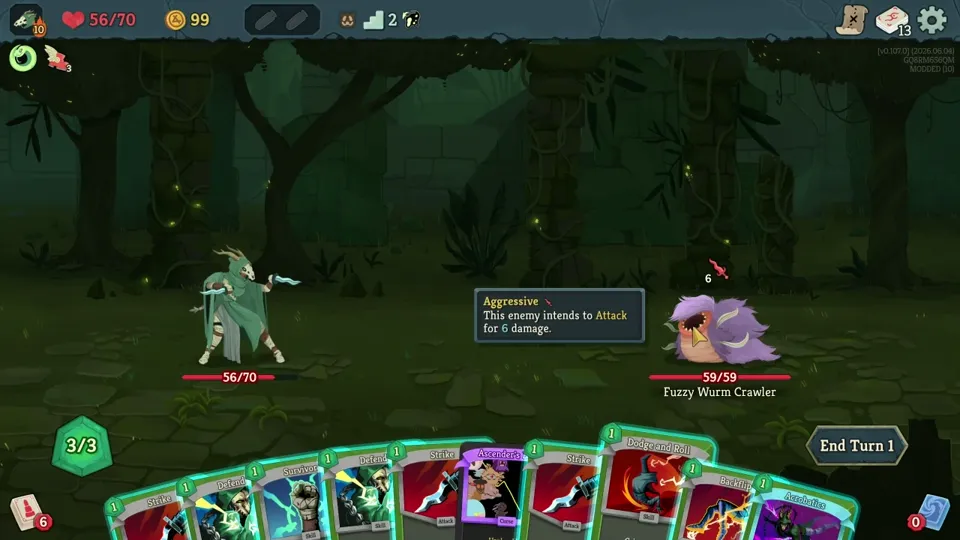

# Backflip



Adds flip animations when playing certain cards!

- **Backflip** — backflip (rotates backward with an arc)
- **Acrobatics** — frontflip (rotates forward with an arc)
- **Dodge and Roll** — forward spin in place (no arc)

## Build

**Requirements**
- .NET 9.0 SDK

**Build & Install**

```bash
dotnet build
```

After building, the DLL is automatically copied to `C:\Program Files (x86)\Steam\steamapps\common\Slay the Spire 2\mods\sts2-backflip\`.
